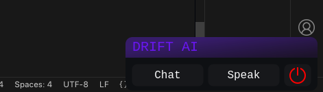
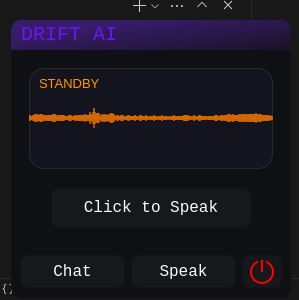

# DriftAI
An LLM powered Open Source AI assistant designed to speed up day-to-day tasks of a PC user.

# Running DriftAI
Somewhat MVP is ready. Follow these steps to run this on Linux:

## `CAUTION!`
`DriftAI` currently runs local `LLM`s on the host machine. That's why the minimum hardware requirements must be met to run this project, which is as follows:
 - 
 - Mandatory: 8GB RAM (Recommended 16GB)
 - Recommended: At least 4GB GPU VRAM (NVIDIA GPU)

## Installation of uv package manager
First we need to install the [uv package manager](https://astral.sh/blog/uv):

### Using `curl` for instalation:
```bash
curl -LsSf https://astral.sh/uv/install.sh | sh
```

### OR, Using `wget` for installation:
```bash
wget -qO- https://astral.sh/uv/install.sh | sh
```

### OR, Using `pip` for installation:
If `python` and `pip` both are installed on the system (which is the case with most linux distributions), just use `pip` to install `uv`:
```bash
pip install uv
```

More details regarding installation can be found on `uv`'s [official website.](https://docs.astral.sh/uv/getting-started/installation/)


## Cloning Github Repo
Next step is cloning this repository using:
```bash
git clone https://github.com/MahirHamiAbrar/DriftAI.git
```

## Project Setup
Once `uv` is installed on the system, we now can use it to setup the development environment:
```bash
cd DriftAI
uv sync
```

Running `uv sync` command installs all the dependencies needed to run the project, and sets up the development environment. Now we are ready to launch DriftAI!

## Launching DriftAI
To launch DriftAI, simply run the below command:
```bash
sh run.sh
```

Currently this does the below two things:
 * Launches the audio recorder floating window.
 * Starts up the Speech-to-Text AI local-server on the host computer.

Voila! You should have a window at the bottom-left corner of your screen like this:

Minimized Floating Window             |  Expanded Floating Window
:-------------------------:|:-------------------------:
  |  

The floating window will expand when the `Speak` button is pressed. Presing `Speak` button again will collapse the expanded window. 

When `Click to Speak` is pressed, voice recording starts. 

Recorded audio clips can be found in `src/driftai/data/audio_recordings` directory which, is the default saving location. This however can be changed from the `src/driftai/data/config.json` file.